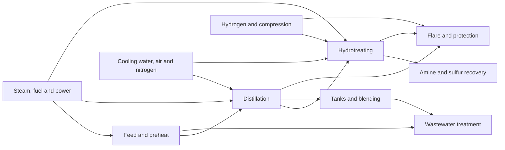

# Process Plant OPC UA Simulator

A deterministic, open-source, plant-wide process-control benchmark with **50
control loops**, **500 temporal signals**, **20 operating and failure
scenarios**, hidden ground truth, offline dataset generation, and an OPC UA
Data Access/Historical Access server.

The project is intended for research, education, integration testing, control
performance monitoring, anomaly detection, fault detection and isolation, and
industrial time-series quality studies.

> **Scientific scope:** this is a transparent grey-box benchmark, not a
> first-principles refinery design simulator and not a substitute for process
> safety or engineering calculations. All data are synthetic.

## Why this benchmark

Classical benchmarks established the value of reproducible plant-wide process
problems and actuator-fault datasets. This project extends that tradition with
a larger, inspectable signal surface and standards-based OPC UA transport:

- a connected refinery-like topology spanning ten process and utility areas;
- feedback, cascade, ratio, inventory, split-range, selector, supervisory, and
  plant-master control structures;
- controller, actuator, sensor, process, and communication failure layers;
- explicit value, quality, source timestamp, and cadence behavior;
- separate observation and hidden-truth artifacts to prevent label leakage;
- deterministic seeds and SHA-256 digests for exact reproduction.

The scientific formulation and limitations are documented in
[Scientific model](docs/scientific-model.md). A concrete paper plan is in
[Research protocol](docs/research-protocol.md). Measured pre-release evidence is
recorded in [Validation](docs/validation.md), and the transport contract is in
[OPC UA interface](docs/opcua-interface.md).

## Plant



| Area | Loops |
| --- | ---: |
| Feed and preheat | 5 |
| Distillation | 8 |
| Hydrotreating and reaction | 7 |
| Hydrogen and compression | 5 |
| Amine and sulfur recovery | 4 |
| Steam, fuel and power | 5 |
| Cooling water, air and nitrogen | 5 |
| Tanks and blending | 4 |
| Wastewater treatment | 4 |
| Flare and protection systems | 3 |

The bundled catalogs are the executable source of truth:

- [`loops.csv`](src/process_lens_opcua_simulator/catalog/loops.csv)
- [`signals.csv`](src/process_lens_opcua_simulator/catalog/signals.csv)
- [`scenarios.csv`](src/process_lens_opcua_simulator/catalog/scenarios.csv)

Visible names and engineering descriptions are in Brazilian Portuguese; code,
identifiers, schemas, and scientific documentation are in English.

## Install

Requires Python 3.12 or newer.

```bash
python -m venv .venv
source .venv/bin/activate
python -m pip install -e '.[test]'
process-plant-simulator validate-catalog
```

## Generate a reproducible dataset

```bash
process-plant-simulator generate \
  --duration-hours 6 \
  --sample-seconds 30 \
  --seed 20260903 \
  --output var/observations.csv \
  --truth-output var/truth.jsonl
```

The command prints the catalog, observation, and truth SHA-256 digests. The
observation CSV never contains fault labels or physical truth. The JSONL truth
file is intended only for scoring and controlled research workflows.

## Run the OPC UA server

```bash
process-plant-simulator serve \
  --endpoint opc.tcp://127.0.0.1:4840/process-plant-simulator/ \
  --history-hours 1
```

Or use the hardened local container profile:

```bash
docker compose up --build
```

Example NodeIds:

```text
ns=2;s=Plant.ControlLoops.FIC-101.PV
ns=2;s=Plant.ControlLoops.FIC-101.SP
ns=2;s=Plant.Areas.FEED.Equipment.FH-101.PRESSURE
```

The bundled anonymous/no-security endpoint binds to loopback and is for local
research only. Do not expose port 4840 to an untrusted network.

## Scenarios

The benchmark includes normal steady operation and load changes, aggressive
and sluggish tuning, local and propagated oscillation, valve stiction,
backlash, actuator saturation, manual operation, setpoint activity, sensor
noise/drift/freeze, gaps, bad quality, loss of communication, irregular
cadence, process disturbances, and multivariable interaction.

The processing order is deliberate:

```text
physical plant -> operating policy -> controller -> actuator
               -> sensor -> transport -> observable OPC UA value
```

This keeps a communication failure from changing the physical plant and keeps
a sensor failure distinct from a process disturbance.

## Reproducibility contract

For a fixed release, catalog digest, seed, start timestamp, integration step,
and scenario cycle, the simulator produces identical observations, truth
states, event transitions, and digests. Dataset splits should be made by seed
and complete scenario cycle, not by randomly mixing adjacent rows.

## Development

```bash
python -m pytest
python -m pytest --cov
python -m build
```

The continuous-integration matrix tests Python 3.12 and 3.13, catalog
integrity, deterministic generation, fault-layer semantics, hidden-truth
separation, plant coupling, packaging, and independent OPC UA reads.

## References

1. Downs, J. J., and Vogel, E. F. (1993). “A plant-wide industrial process
   control problem.” *Computers & Chemical Engineering*, 17(3), 245–255.
   [doi:10.1016/0098-1354(93)80018-I](https://doi.org/10.1016/0098-1354(93)80018-I)
2. Bartyś, M., Patton, R. J., Syfert, M., de las Heras, S., and Quevedo, J.
   (2006). “Introduction to the DAMADICS actuator FDI benchmark study.”
   *Control Engineering Practice*, 14(6), 577–596.
   [doi:10.1016/j.conengprac.2005.06.015](https://doi.org/10.1016/j.conengprac.2005.06.015)
3. Choudhury, M. A. A. S., Thornhill, N. F., and Shah, S. L. (2005).
   “Modelling valve stiction.” *Control Engineering Practice*, 13(5), 641–658.
   [doi:10.1016/j.conengprac.2004.05.005](https://doi.org/10.1016/j.conengprac.2004.05.005)
4. OPC Foundation. *OPC Unified Architecture, Part 11: Historical Access*,
   release 1.05.04.
   [OPC 10000-11](https://reference.opcfoundation.org/Core/Part11/v105/docs/)

These works motivate the benchmark design; no source code, process data, or
copyrighted model implementation from them is included here.

## Citation and license

Please use the repository’s [`CITATION.cff`](CITATION.cff). The software and
original documentation are licensed under the Apache License 2.0. Catalog data
created in this repository are included under the same license.
